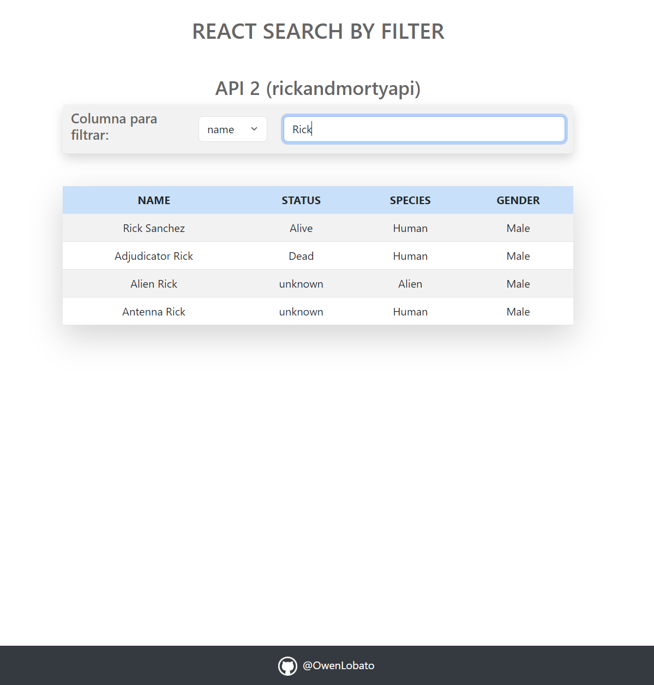

# Search data by filter
Application that allows you to search and filter information from a given API.
The application uses React and Bootstrap for the user interface and custom hooks to obtain the data from the APIs, it has the Search component that shows the information in a table and allows you to filter the data in real time to perform your search with a text field input.

## Installation and use

To use the application, you must clone the repository and then install the dependencies by running the following commands:

```bash
  git clone https://github.com/OwenLobato/search_filter.git
  cd search_filter
  npm install
```

Then, what you should do is run the application in your local environment, executing
``` npm start ```
in the consol, the app should automatically open in your default browser. If not, you can enter http://localhost:3000/ 

## Search Component
The Search component is responsible for performing the search and filtering of the data obtained through the "getObjects" prop. This prop is called by the "obtainObjects" function, which returns the response to the API request. In addition, it is passed an array with the columns that will be displayed in the table, according to the keys of the object obtained from the API.

```javascript
import Search from "./components/Search";

<Search
  getObjects={obtainObjects}
  tableColumns={["column1", "column2", ... , "columnN"]}
/>
```

This is a generic example of the response that should be received from the API
```json
[
  {
    "column1": "Value 1",
    "column2": "Value 2",
    "column3": "Value 3"
    ...
  },
  {
    "column4": "Value 4",
    ...
  },
  ...
  {
    "columnN": "Value n",
    ...
  }
]
```


## Examples

This is how the application is displayed with the data from API 1 (https://jsonplaceholder.typicode.com/users) and the selected columns


This is how it looks with the data from API 2 (https://rickandmortyapi.com/api/character/?page=1)


Here is a filter by name (first column selected by default) in API 2


Here are the possible filters that can be performed (according to the table columns or the object keys), but a filter is selected by another column other than the default (species)


And this is what it will look like when there are no matches


